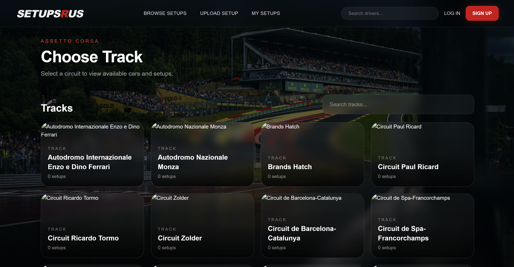
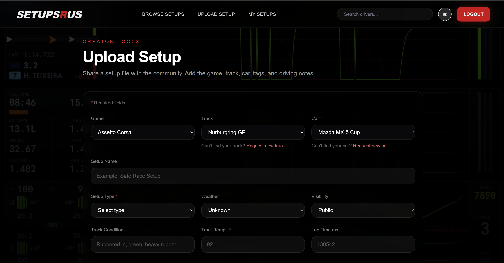
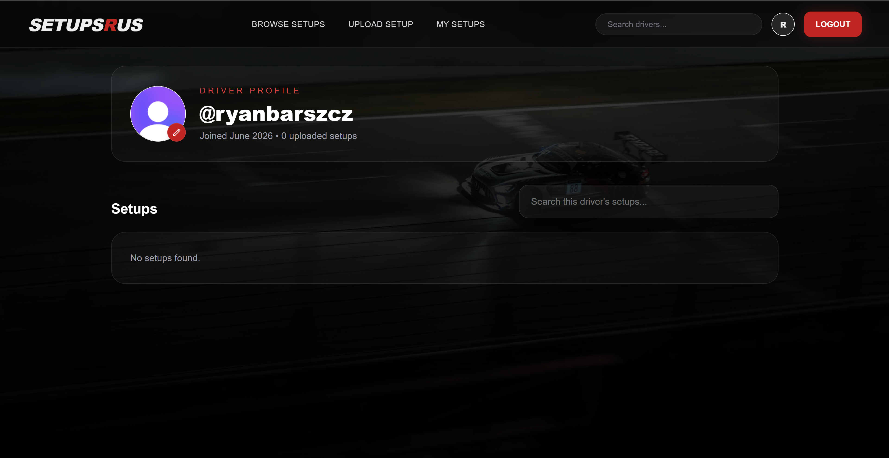

# SetupsRUS

A community-driven platform for sim racers to discover, share, and download car setups for popular racing simulators.


## Live Demo

**Frontend:** [https://setupsrus.com](https://setupsrus.com/)

## Features

### Browse Setups

* Browse setups by game, track, and car
* Filter and sort setups
* View setup details and metadata
* Search community uploads

### User Accounts

* Secure authentication with Clerk
* User profiles
* Profile pictures
* Personal setup management

### Upload & Share

* Upload setup files
* Add setup descriptions and tags
* Track setup downloads and votes
* Edit or delete your own setups

### Community Features

* Upvote useful setups
* Download community-created setups
* Browse creator profiles
* Discover popular content

### Setup Metadata

Optional setup information includes:

* Lap time
* Weather conditions
* Track conditions
* Tire compound
* Fuel load
* Temperature
* Setup type

## Tech Stack

### Frontend

* Next.js 16
* TypeScript
* Tailwind CSS
* Clerk Authentication
* Sonner Toasts
* Lucide Icons

### Backend

* Node.js
* Express
* TypeScript
* Prisma ORM

### Database & Storage

* Neon PostgreSQL
* AWS S3

### Deployment

* Vercel
* Neon
* AWS

## Architecture

Frontend communicates with a REST API built with Express and Prisma. Uploaded setup files are stored in AWS S3 while metadata is stored in Neon PostgreSQL. Authentication and user management are handled through Clerk.

## Future Improvements

* Expanded game, track, and car image library
* Manufacturer and model hierarchy
* Setup request system
* Enhanced search and filtering
* Improved analytics and rankings
* Creator-focused features
* Premium setup marketplace

## Screenshots

### Home Page


### Browse Setups



### Upload Setup



### User Profile



## Local Development

### Frontend

```bash
cd frontend
npm install
npm run dev
```

### Backend

```bash
cd backend
npm install
npm run dev
```

## Author

Ryan Barszcz

Computer Science Graduate — University of Michigan

Portfolio: https://ryanbarszcz.com
